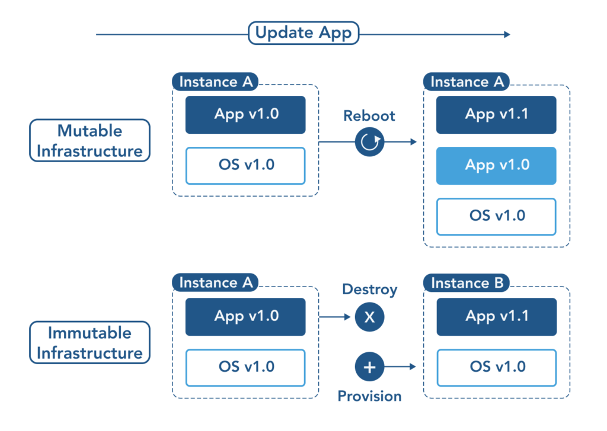

# 🔁 Mutable vs. Immutable Infrastructure in Terraform

---

## 🧬 What is Mutable Infrastructure?

**Mutable Infrastructure** refers to infrastructure components that are **modified or updated in place**.

### ✅ Characteristics:
- Resources **change over time** (e.g., patching a server).
- Changes are applied **on the existing resource**.
- Quick to fix or update small issues.

### ❌ Drawbacks:
- High risk of **configuration drift**.
- Manual changes may go undocumented.
- Harder to reproduce environments exactly.

### 🛠️ Terraform Example:
```hcl
resource "aws_instance" "web" {
  ami           = "ami-123456"
  instance_type = "t2.micro"
  tags = {
    Name = "WebServer"
  }
}
````

---

## 🧊 What is Immutable Infrastructure?

**Immutable Infrastructure** means components are **not changed once deployed**. Any update leads to **recreating** the resource from scratch.

### ✅ Benefits:

* No drift — **every change is versioned** and consistent.
* Ideal for **CI/CD** and **auto-scaling** workflows.
* Easier to debug and audit.

### ❌ Drawbacks:

* Slightly higher resource cost and provisioning time.
* Requires good automation and planning.

### 🛠️ Terraform Example (Immutable Practice):

```hcl
resource "aws_launch_template" "app" {
  name_prefix   = "app-launch-"
  image_id      = "ami-0abc1234"
  instance_type = "t2.micro"
}
```

---

## 🖼️ Diagram: Mutable vs Immutable

 <!-- Replace with your actual image path -->

This image shows the difference clearly:

* Mutable: App is updated in-place (v1.0 → v1.1)
* Immutable: Old instance is destroyed, and a new one is provisioned

---

## 🆚 Key Differences Table

| Feature             | Mutable Infrastructure               | Immutable Infrastructure                |
| ------------------- | ------------------------------------ | --------------------------------------- |
| Update Method       | Modify existing resource             | Replace with a new version              |
| Configuration Drift | Common                               | Avoided                                 |
| Change Rollback     | Harder                               | Easier (revert version)                 |
| Ideal for           | Legacy apps, quick patches           | CI/CD pipelines, scalable microservices |
| Terraform Pattern   | Direct updates via `terraform apply` | Blue-Green, Launch Templates, Modules   |
| Risk Factor         | Higher (due to in-place changes)     | Lower (fully controlled rollouts)       |

---

## 💡 Real-World Analogy

* **Mutable Infra**: Like updating apps or OS on your existing laptop.
* **Immutable Infra**: Like replacing the laptop with a new one pre-installed with everything.

---

## 📌 Summary

* Mutable Infra: **Quick and easy**, but risks **inconsistency**.
* Immutable Infra: **Reliable, repeatable**, ideal for modern DevOps workflows.
* Terraform supports both, but **Immutable is best practice for production**.

