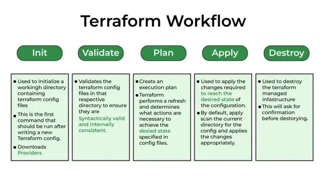

# 🧠 Terraform Workflow



Terraform follows a structured lifecycle to **provision, manage, and destroy infrastructure** safely and predictably. Each step plays a vital role in managing cloud resources efficiently.

---

## 1️⃣ `terraform init` – Initialize the Configuration Directory

### ✅ Purpose:
Initializes the project, sets up providers, and configures the backend.

```bash
terraform init
````

### 🔍 What Happens:

* Downloads required providers (e.g., AWS).
* Initializes backend (e.g., S3 + DynamoDB).
* Sets up modules if any.

### 🧠 Real-Time Tip:

* Creates `.terraform/` and `.terraform.lock.hcl`
* Always run after cloning a repo or changing providers/backends.

---

## 2️⃣ `terraform validate` – Validate Configuration Files

### ✅ Purpose:

Ensures the configuration is **syntactically valid** and **internally consistent**.

```bash
terraform validate
```

### 🔍 What Happens:

* Parses `.tf` files for errors.
* Checks for invalid references or missing variables.

> ❌ It does **not** connect to AWS or validate actual infrastructure.

---

## 3️⃣ `terraform plan` – Preview Execution Plan

### ✅ Purpose:

Shows what changes Terraform will make without applying them.

```bash
terraform plan
```

### 🔍 What Happens:

* Refreshes the current state with real AWS data.
* Compares `.tf` config with `.tfstate` and cloud resources.
* Outputs a step-by-step change plan (create/update/delete).

### 🧠 Best Practice:

Save the plan for safer apply:

```bash
terraform plan -out=tfplan
```

---

## 4️⃣ `terraform apply` – Apply the Desired State

### ✅ Purpose:

Creates or updates infrastructure to match the `.tf` files.

```bash
terraform apply
```

### 🔍 What Happens:

* Executes plan and calls AWS API.
* Provisions or updates resources.
* Updates `.tfstate` with actual resource data.

> ⚠️ Use `-auto-approve` only in CI/CD (after testing).

---

## 5️⃣ `terraform destroy` – Tear Down Infrastructure

### ✅ Purpose:

Deletes all resources defined in the configuration.

```bash
terraform destroy
```

### 🔍 What Happens:

* Reads `.tfstate`
* Sends delete requests to AWS
* Updates state after deletion

> ⚠️ Never run in production unless decommissioning resources.

---

## 🔄 Full Workflow Summary

| Phase      | Command              | Purpose                                 |
| ---------- | -------------------- | --------------------------------------- |
| `init`     | `terraform init`     | Set up providers, backends, and modules |
| `validate` | `terraform validate` | Check syntax and internal consistency   |
| `plan`     | `terraform plan`     | Preview infrastructure changes          |
| `apply`    | `terraform apply`    | Provision/update infrastructure on AWS  |
| `destroy`  | `terraform destroy`  | Delete all Terraform-managed resources  |

---

## 📘 Real-Time Example

### ✅ main.tf

```hcl
provider "aws" {
  region = "us-east-1"
}

resource "aws_instance" "demo" {
  ami           = "ami-0c55b159cbfafe1f0"
  instance_type = "t2.micro"
}
```

### ✅ Workflow Steps:

```bash
terraform init
terraform validate
terraform plan
terraform apply
terraform destroy
```

---

## ✅ Best Practices for Projects

* Use **S3 + DynamoDB** for remote state and locking.
* Use **modules** to organize and reuse Terraform code.
* Keep **dev/test/prod** isolated (folders/workspaces).
* Do **not** commit `.tfstate` or `.terraform/` folders to Git.
* Review `plan` output before running `apply`.


